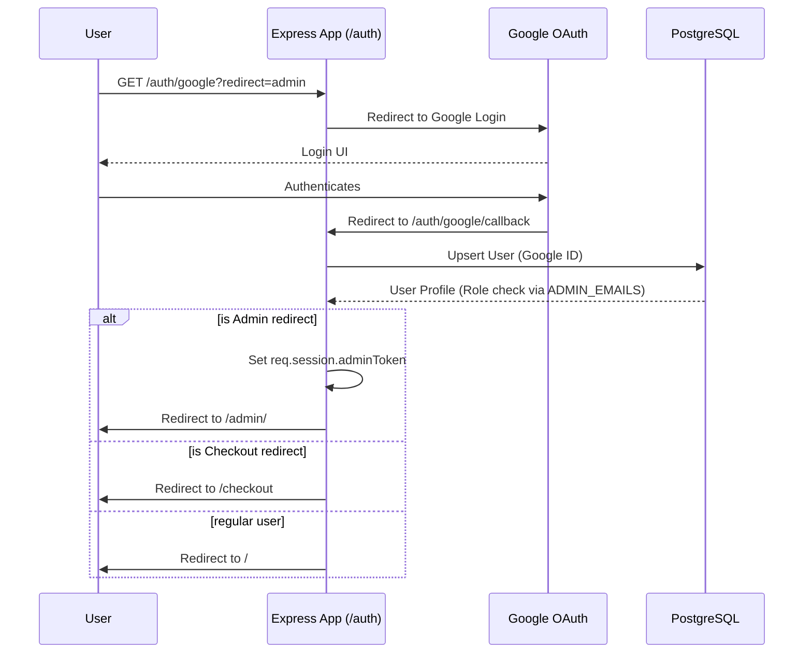

# Authentication Flow

## Overview
Authentication is handled primarily via Google OAuth 2.0 using `passport-google-oauth20`. Users and Admins share the same auth flow, but Admins are determined by checking if their email is in the `ADMIN_EMAILS` environment variable.

## Endpoints

1. **GET /auth/google**
   - Initiates Google OAuth flow.
   - Accepts a `?redirect=` query param (e.g., `admin` or `checkout`) and passes it as `state`.

2. **GET /auth/google/callback**
   - Callback URL from Google.
   - Uses Passport to authenticate.
   - Checks `state` for redirects:
     - If `admin` and user is in `ADMIN_EMAILS`, issues an admin session token and redirects to `/admin/?auth=google`.
     - If `checkout`, redirects to `/checkout`.
     - Otherwise, redirects to `/`.

3. **GET /auth/logout**
   - Logs out the user and destroys the DB-backed session.
   - Redirects to `/`.

4. **GET /auth/me**
   - Returns the current authenticated user's profile and roles.

5. **GET /auth/admin-token**
   - Provides a token for the frontend admin panel to use in subsequent API calls if the user is an admin.

## Flowchart

