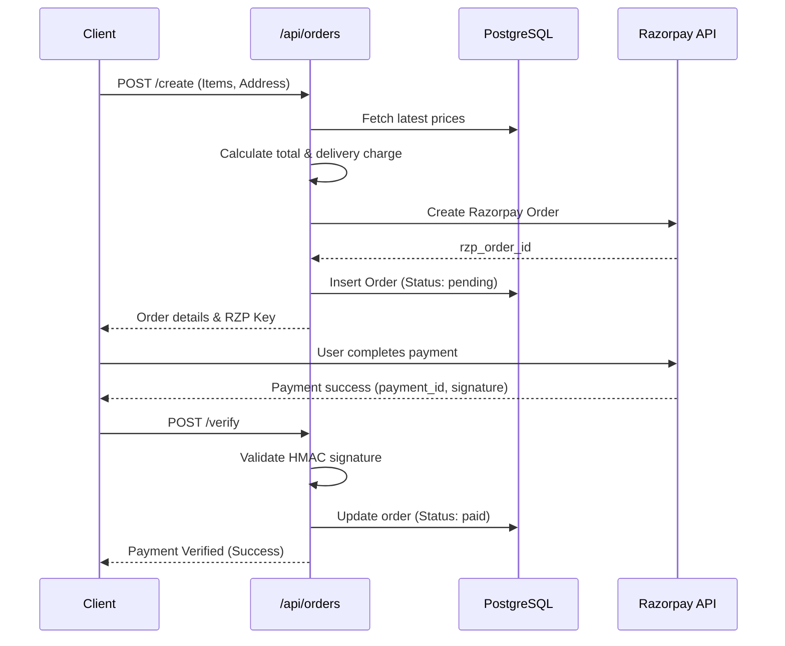

# Orders and Checkout Flow

## Overview
The orders flow integrates with Razorpay for secure payments. It calculates delivery charges based on state (Kerala vs Rest of India) and item volume. 

## Endpoints

1. **POST /api/orders/create**
   - **Inputs**: Cart items, delivery address.
   - **Logic**:
     1. Validates prices against the database to prevent client-side tampering.
     2. Calculates subtotal and volumetric delivery charge (KERALA_BASE or NATIONAL_BASE + extra item rate).
     3. Calls Razorpay API to create an order instance.
     4. Saves the pending order to PostgreSQL.
   - **Outputs**: Razorpay Order ID, Amount, Key ID for frontend checkout.

2. **POST /api/orders/verify**
   - **Inputs**: `orderId`, `razorpayOrderId`, `razorpayPaymentId`, `razorpaySignature`.
   - **Logic**:
     1. Verifies the Razorpay HMAC SHA256 signature.
     2. Updates the order status to `paid` in DB.
     3. Triggers asynchronous email confirmations.
   - **Outputs**: Success flag.

3. **GET /api/orders/my**
   - Returns all orders for the currently authenticated user.

4. **GET /api/orders/:id/tracking**
   - Retrieves tracking states via the `ParcelsApp` API.

5. **GET /api/orders/:id/invoice**
   - Generates and returns a PDF invoice.

6. **POST /api/orders/:id/cancel**
   - Cancels a pending/paid order.

## Flowchart

