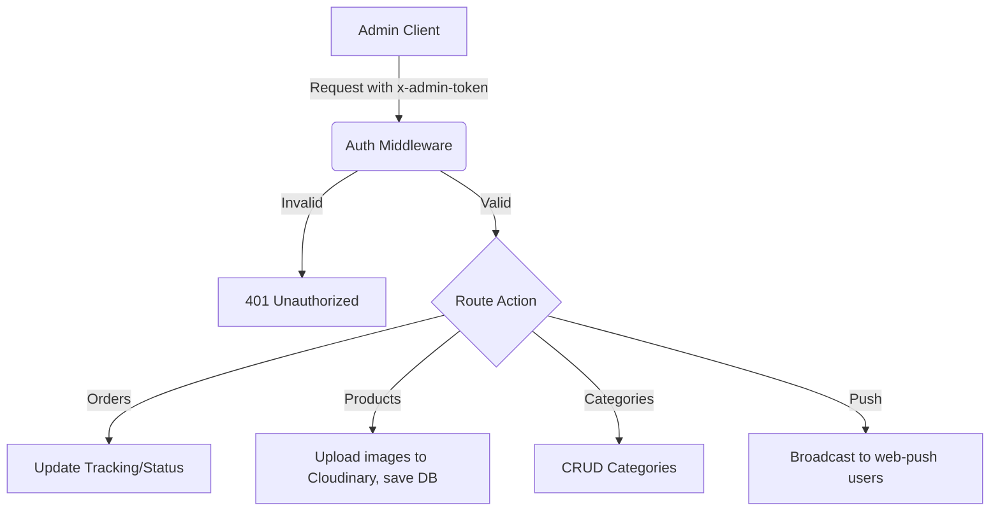

# Admin Dashboard Flow

## Overview
The Admin dashboard (`/api/admin`) controls the e-commerce operations. All endpoints use a custom auth middleware (`auth(req, res, next)`) that verifies an `x-admin-token`, session admin status, or Passport session + `ADMIN_EMAILS` check.

## Endpoints

1. **Auth & Sessions**
   - `POST /api/admin/login`: Alternative simple password login (checks against `ADMIN_PASSWORD`). Returns a token.
   - `POST /api/admin/logout`: Invalidates tokens and session.

2. **Order Management**
   - `GET /api/admin/orders`: Fetch all orders.
   - `PATCH /api/admin/orders/:id/status`: Updates order status (pending, shipped, delivered, etc.). Handles tracking ID integration with `ParcelsApp`.

3. **Categories Management**
   - `GET /api/admin/categories`
   - `POST /api/admin/categories`: Creates category, uploads cover image to Cloudinary (if configured) or stores base64.
   - `PUT /api/admin/categories/:id`
   - `DELETE /api/admin/categories/:id`

4. **Product Management**
   - `GET /api/admin/products`
   - `POST /api/admin/products`: Creates product, handles array of base64 images -> Cloudinary.
   - `PUT /api/admin/products/:id`
   - `PATCH /api/admin/products/:id/stock`: Quick toggle for stock statuses.
   - `DELETE /api/admin/products/:id`

5. **Users & Push**
   - `GET /api/admin/users`: Lists users.
   - `POST /api/admin/push/send`: Broadcasts push notifications to all subscribed devices.

## Flowchart

