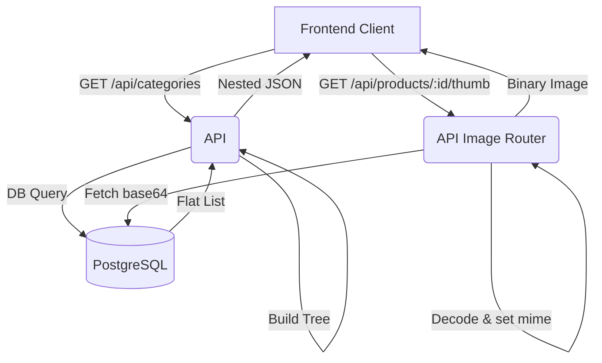

# Products and Categories Flow (Public API)

## Overview
The public API routes (`/api`) serve product listings, category hierarchies, product reviews, and images to the storefront.

## Endpoints

1. **Categories**
   - `GET /api/categories`: Returns a nested hierarchical list of categories (parent/child relationships) and product counts.
   - `GET /api/subcategories?parent=Name`: Returns direct subcategories for a given parent name.
   - `GET /api/categories/:id/cover`: Serves the category cover image (binary base64 decoded).

2. **Products**
   - `GET /api/products`: Returns lightweight product list (no full images, just a thumb URL), sortable and filterable by category.
   - `GET /api/products/:id`: Returns full product details (including all image URLs).
   - `GET /api/products/:id/thumb`: Serves the primary thumbnail image binary.
   - `GET /api/products/:id/image/:idx`: Serves the nth image for the product.
   - `GET /api/featured` & `GET /api/sale`: Quick endpoints for featured and on-sale items.

3. **Reviews**
   - `GET /api/products/:id/reviews`: Fetches product reviews and calculates average rating.
   - `POST /api/products/:id/reviews`: Submits a new review (1-5 rating).

4. **Stats**
   - `GET /api/stats`: Dashboard data for Admin overview (Orders, revenue, users).

## Flowchart (Category/Product Request)

