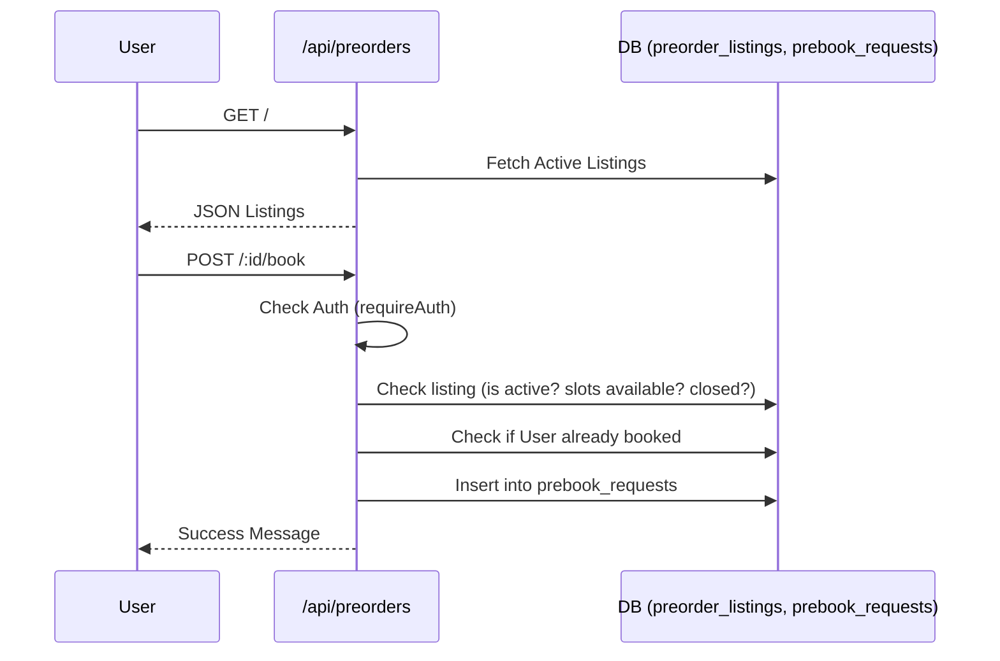

# Pre-orders Flow

## Overview
The pre-orders system allows users to book items before they are available in stock. It has dedicated database tables (`preorder_listings`, `prebook_requests`) and operates slightly differently from standard cart checkout. Pre-booking requires authentication but does not require immediate payment.

## Endpoints

### Public Endpoints
1. **GET /api/preorders**
   - Returns all active pre-order listings, removing large payloads (images) and appending `booked_count`.
2. **GET /api/preorders/:id/thumb**
   - Serves the listing image binary.
3. **POST /api/preorders/:id/book**
   - **Requires Login** (`requireAuth`).
   - Checks if the user already booked, if the maximum slots are filled, or if the deadline (`closes_at`) has passed.
   - Records the prebook request in the database.

### Admin Endpoints (`/api/preorders/admin/*`)
- **Listings CRUD**: `GET /listings`, `POST /listings`, `PUT /listings/:id`, `DELETE /listings/:id`.
- **Bookings View**: `GET /bookings` fetches a joined list of users and their requested preorder items.

## Flowchart

